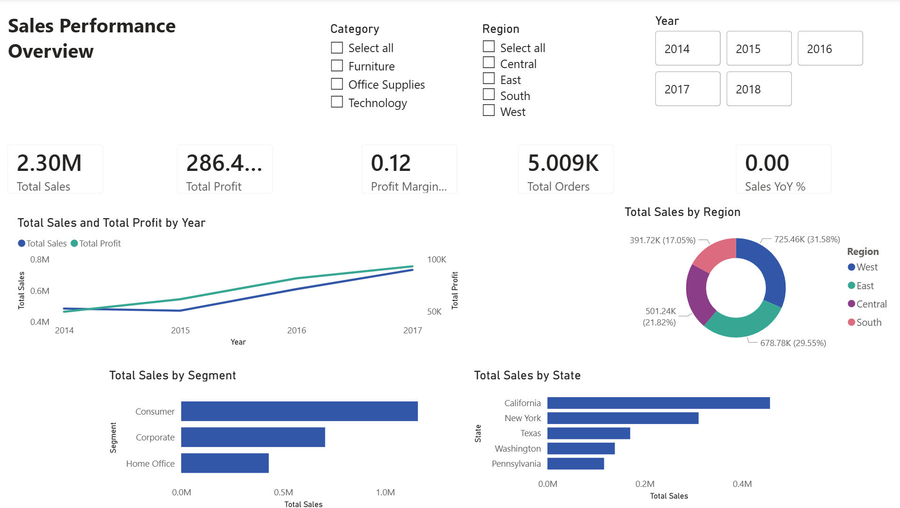
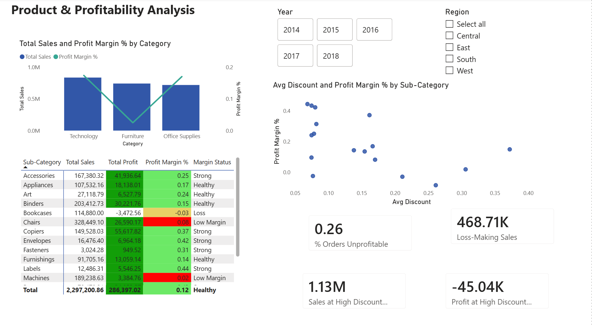
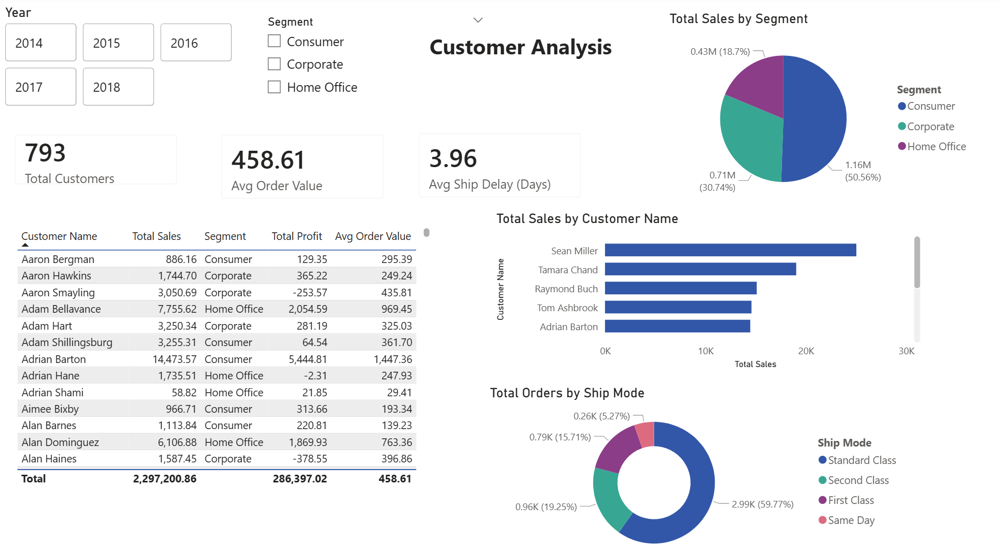

# Superstore Sales & Profitability Dashboard

## Overview
An end-to-end Business Intelligence dashboard built in Power BI analyzing
4 years of retail transaction data across 3 product categories, 4 regions,
and 793 customers. The goal was to identify what drives profitability and
where the business is losing money.

## Dashboard Pages
- **Page 1 — Executive Overview:** KPIs, sales trend, regional breakdown
- **Page 2 — Product Analysis:** Category profitability, discount impact, sub-category performance
- **Page 3 — Customer Analysis:** Top customers, segment breakdown, shipping analysis

## Key Insights
1. **Furniture is sold at a loss in the Central region** : discount rates above
   20% on Tables and Bookcases result in negative profit margin despite strong sales volume
2. **Technology drives 60% of total profit** despite being the second-largest
   category by sales, Copiers and Accessories are the highest-margin sub-categories
3. **High discounting (20%+) correlates with negative margins** — orders with
   discounts above 20% account for 50% of total orders but generate negative profit

## Tools Used
- Power BI Desktop (DAX, Power Query, Data Modelling)
- Data source: Sample Superstore Dataset (Kaggle)

## Live Dashboard

## Screenshots

